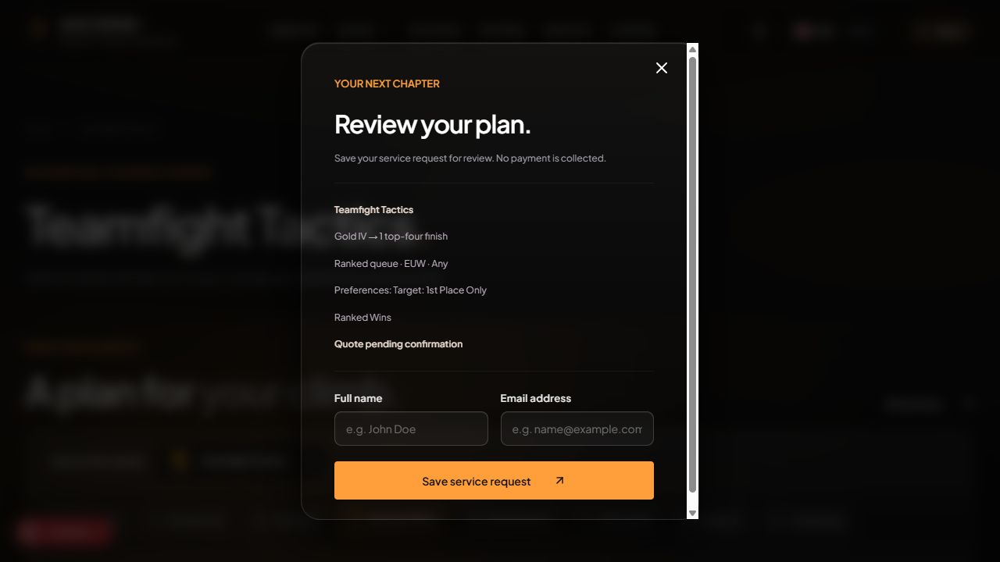

# Kiểm tra lại product flow — ASCEND

Ngày: 07/10/2026. Môi trường: ứng dụng đang chạy tại http://localhost:3000.

## Kết luận

Chưa thể xác nhận CHECKLIST đã hoàn thành product flow 100%. Các màn hình và nhiều bước truyền thông tin đã có, nhưng điều hướng, khôi phục category và đồng bộ region/queue/mục tiêu đơn vẫn lỗi.

Không chỉnh sửa code. Báo cáo này phân biệt kiểm tra trên UI với nhận xét qua mã nguồn.

## Phạm vi đã kiểm tra

- Bấm và đọc nội dung 32 category: LoL 14, Valorant 10, TFT 8. Đây là kiểm tra hiển thị/chuyển category, không phải xác nhận mọi tổ hợp đầu vào hoặc mọi category đã hoàn tất giao dịch.
- Account DEMO-L01 → Buy Account Now → review → đóng → Back to Catalog.
- Coaching directory → Luna → gói duo Diamond → Master, 3 games → review → yêu cầu đăng nhập.
- TFT Double Up qua URL trực tiếp và qua tab.
- Coaching trước và sau reload.
- Valorant region mặc định, chọn EU, reload và chọn NA.
- TFT Ranked Wins → 1st Place Only → review.
- Không đăng nhập bằng tài khoản thật, không tạo tài khoản, không thanh toán, không tạo đơn sau đăng nhập. Không chạy lại build.

## Các lỗi đã quan sát trực tiếp

### R01 — P1: Double Up có thể trở thành Ranked

1. Mở `/games/teamfight-tactics?category=double-up` trong tab mới.
2. Tab Double Up được chọn nhưng queue là Ranked, tóm tắt EUW · Ranked, giá US$131.29.
3. Mở review: vẫn ghi Ranked queue và Rank boost.
4. Chuyển Divisions rồi bấm Double Up: có lần queue đổi đúng Double Up và chuyển sang Request a quote.

Kết quả cùng category phụ thuộc cách vào trang. Đợt rà toàn bộ tab cũng gặp Double Up vẫn giữ Ranked. Cần thống nhất category, service, queue và cách tính giá trước khi cho review.

### R02 — P1: Reload Coaching hiển thị Rank boost

1. Chọn Coaching, directory có 3 coach LoL.
2. Reload URL `/games/league-of-legends?category=coaching#configure`.
3. Nội dung trở thành Gold IV → Diamond IV, Solo, Rank boost, US$263.69.

Category trong URL chưa khôi phục đúng dịch vụ. Chuyển từ một số tab khác sang Coaching có thể hiển thị directory đúng; đây là lỗi đồng bộ trạng thái, không phải directory bị thiếu hoàn toàn.

### R03 — P1: Region Valorant hiển thị một nơi, báo giá một nơi

1. Mở `/games/valorant` sau một phiên sạch/reload.
2. Ô region hiển thị North America; tóm tắt lại ghi EUW · Competitive · Duelist, giá US$50.35.
3. Mở selector và chọn North America NA thật: tóm tắt thành NA, giá US$47.55 và giảm 15% NA.

Region hiển thị không phản ánh region được dùng tính giá. Các category Valorant khác cũng có thể mang EUW trong tóm tắt.

### R04 — P1: Draft region bị mất khi reload

1. Valorant chọn Europe EU: tóm tắt thành EU, Request a quote.
2. Reload: quay lại ô North America nhưng tóm tắt EUW và giá US$50.35.

Lưu category trong URL không tương đương lưu draft. Cần khôi phục đồng thời game/category/region/rank/queue/options và xác thực giá trị hợp lệ theo game.

### R05 — P1: Back to Catalog đưa về trang chủ

1. Mở `/account/DEMO-L01`.
2. Bấm Back to Catalog. DOM của link ghi `/games/league-of-legends?category=accounts`.
3. Kết quả thực tế: URL `/`, nội dung trang chủ.

Đã quan sát hai lần, một lần sau đóng review và một lần từ trang detail mới mở. Chưa xác định nguyên nhân. Cần kiểm tra điều hướng chạy thực tế; không thể đánh dấu đúng chỉ dựa trên href trong source.

### R06 — P2: Mục tiêu TFT Top 1 không đồng bộ với review

1. Chọn Ranked Wins → 1st Place Only (First Pick).
2. Bấm Review request.
3. Review ghi `Gold IV → 1 top-four finish`, trong khi Preferences ghi `Target: 1st Place Only`.

Hai thông tin trong cùng đơn mâu thuẫn. Nhãn quantity, Your goal và review phải phản ánh đúng Top 1/Top 4.

## Các bước hoạt động đúng trong ca đã kiểm tra

| Ca | Kết quả |
| --- | --- |
| Account DEMO-L01 → review | Giữ account ID, Diamond IV, EUW và US$129.00 |
| Luna duo → review | Giữ Luna, Diamond → Master Duo, 3 × US$12.99 = US$38.97 |
| Save service request khi chưa đăng nhập | Chuyển đến login, không thu tiền |
| Category catalog/form | 32 category đều có màn hình; nhiều category đặc thù đi theo custom quote |
| Cosmetics / inventory LoL | Cosmetics nằm trước Champions; thấy 38 skin và nút load more champions +92 trên DEMO-L01 |

Các kết quả này chỉ xác nhận bước đang nêu, không chứng minh cả luồng thanh toán/giao hàng đã hoàn tất.

## Các điểm xác nhận qua code, chưa kiểm tra end-to-end

### C01 — P1: Account và coach có nguy cơ giữ đồng thời payload

`BoostRoyalAccountView.tsx` đặt accountPurchase nhưng không xóa coachBooking. `CoachProfile.tsx` đặt coachBooking nhưng không xóa accountPurchase. Setter trong `store/useStore.ts` bỏ qua reset tự động khi payload có quoteOverride.

`Dialogs.tsx:58` ưu tiên giá coach, còn `Dialogs.tsx:92` ưu tiên service account. Nếu cả hai payload còn tồn tại, loại đơn và giá có thể không thuộc cùng sản phẩm. Chưa tái hiện hoàn chỉnh trên UI trong lượt này; cần kiểm tra hồi quy sau khi sửa điều hướng.

### C02 — P1: Đăng nhập chưa khôi phục review/draft đầy đủ

UI đã chuyển đến `/login?next=%2Fcoaches%2Fluna%3Fgame%3Dleague-of-legends`. `Dialogs.tsx:79–80` chỉ lưu pathname/search; `AuthPanel.tsx:49` replace về returnTo. Không có cờ mở lại review hoặc cơ chế persist draft trong Zustand hiện tại.

Chưa thực hiện đăng nhập thật để kiểm chứng màn hình sau đăng nhập. Không nên đánh dấu luồng này hoàn tất chỉ vì có redirect.

### C03 — P1: Tracking vẫn là mô phỏng

`OrderTracking.tsx:33` dùng timer, tiến độ từ demo.points, danh sách trận từ demo.matches và player NOVA cố định. Có hiển thị request mới nhất nhưng chưa chứng minh tiến độ đến từ dữ liệu thực của chính đơn đó.

### C04 — P2: Pricing region chưa khớp selector Valorant

Selector dùng NA/EU/AP/KR/BR/LATAM; bảng giá hiện dùng các khóa gồm NA/EUW/EUNE/OCE/KR/SEA. UI chọn EU đã chuyển sang Request a quote. Đây có thể là fallback có chủ đích, nhưng cần định nghĩa rõ shard nào có giá tự động và shard nào cần báo giá; không đánh dấu đầy đủ pricing chỉ vì selector đã đổi.

## Đối chiếu CHECKLIST

| Mục checklist | Đánh giá sau kiểm tra |
| --- | --- |
| F01 account handoff | Review riêng hoạt động; nút quay catalog lỗi; chưa xác nhận stock/payment/delivery |
| F02 coach handoff | Gói/coach/giá đúng trong ca Luna; còn rủi ro payload và quay lại sau login |
| F03 tracking | Chưa đạt tracking thực; vẫn dùng demo |
| F04 URL/draft | Không đạt: Coaching reload sai dịch vụ, region không được giữ |
| F05 dữ liệu theo game | Đã cải thiện nhãn; chưa xác nhận toàn bộ fixture là dữ liệu sản phẩm thật |
| F06 region | Chưa đạt: region UI và quote khác nhau ở Valorant |
| F07 role | Có role theo game; chưa kiểm tra mọi role tới request sau login |
| F08 category đặc thù | Có form, Clash tier/booster count và TFT Top 1; Top 1 review vẫn mâu thuẫn |
| F09 branding/currency | Có ASCEND và USD/EUR; không chứng minh các claim bảo hành/verified là dữ liệu thực |
| F10 catalog | Có filter/catalog/load more; chưa xác nhận phục hồi filter khi quay lại detail |
| F11 | Build/Suspense không thay thế tiêu chí nội dung/i18n của product flow gốc |

## Thứ tự xử lý đề xuất

1. Đồng bộ category/service/queue khi mở URL, bấm tab và reload; xử lý R01–R02.
2. Chuẩn hóa region trong store và pricing; xử lý R03–R04.
3. Sửa điều hướng Back to Catalog và phục hồi filter/scroll; xử lý R05.
4. Dùng một draft có loại đơn rõ ràng, tránh giữ account và coach đồng thời; xử lý C01.
5. Lưu/khôi phục draft và tự mở lại review sau login; xử lý C02.
6. Đồng bộ mục tiêu Top 1/Top 4; xử lý R06.
7. Nối đơn, payment/delivery và tracking với backend trước khi tuyên bố hoàn tất product flow.

Tiêu chí nghiệm thu: cùng lựa chọn phải cho cùng loại đơn, queue, region, mục tiêu và giá dù người dùng vào từ tab, URL trực tiếp, Back hoặc reload. Thông tin phải giữ nhất quán từ configurator/detail đến review và request đã lưu.
