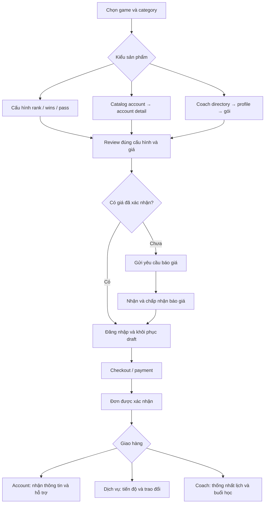

# Review luồng sản phẩm và UI: BoostRoyal ↔ ASCEND / Web-Booster

**Ngày review:** 07/10/2026  
**Phạm vi:** toàn bộ danh mục công khai của League of Legends, Teamfight Tactics và Valorant; catalog, configurator, account detail, coaching, review đơn và bước sau mua.  
**Đầu ra:** tài liệu để review và chọn hướng triển khai. Chỉ tạo file Markdown này.

## 1. Cách đọc và giới hạn của báo cáo

- **Tham chiếu:** truy xuất nội dung/form của 30 trang danh mục BoostRoyal: LoL 14, TFT 6, Valorant 10. Link từng trang nằm ngay trong bảng ở mục 4.
- **Project:** đọc route, component đang được render, dữ liệu mock, store, logic báo giá và lưu yêu cầu. Project hiện có 32 mục: LoL 14, TFT 8, Valorant 10.
- **UI local đã quan sát:** trang game LoL/TFT/Valorant, LoL Pro Games, TFT Ranked Wins, Valorant Accounts và detail `DEMO-V01`; account LoL `DEMO-L01` ở viewport mobile 390 × 844. Việc quan sát này là mẫu đại diện, không phải kiểm tra mọi danh mục trên mọi thiết bị.
- **Giới hạn tham chiếu:** mở trực tiếp `boostroyal.com/lol-account` trong trình duyệt của phiên review trả về 404. Công cụ web vẫn truy xuất được nội dung công khai, một phần từ bản crawl trước đó. Vì vậy, so sánh BoostRoyal tập trung vào cấu trúc thông tin/form và luồng được mô tả; không kết luận độ giống từng pixel, animation hiện hành hay lỗi 404 của website với mọi người dùng.
- Trang [account #109084](https://boostroyal.com/account/109084) được truy xuất từ bản crawl cũ hơn các trang danh mục. Dùng để tham khảo nhóm thông tin account; không dùng giá, số sales hay trạng thái tồn kho của nó làm chuẩn hiện tại. Ảnh người dùng đã gửi là tham khảo thị giác bổ sung.
- Không thực hiện giao dịch, gửi yêu cầu mua, đăng nhập hoặc kiểm chứng backend/payment của BoostRoyal. Những nội dung như bảo hành, giao ngay, tracking và chat trên website là thông tin họ công bố, chưa được kiểm chứng bằng giao dịch trong review này.
- **P0:** phải xử lý trước khi mở mua/đặt dịch vụ thật. **P1:** ảnh hưởng lựa chọn sản phẩm, độ đúng dữ liệu hoặc khả năng hoàn tất luồng. **P2:** tăng độ rõ, tính nhất quán và chất lượng tương tác.

## 2. Kết luận chính

Project đã có nền UI tương đối đầy đủ: danh mục cho cả ba game, rank picker, bộ lọc account, profile coach, summary, USD/EUR và nhiều cải tiến glass/dropdown. Phần thiếu lớn nhất là **nối các màn hình thành một luồng mua đúng dữ liệu và hoàn chỉnh**.

### Những phần đã có nên giữ

- Tab danh mục đầy đủ tương ứng với phạm vi tham chiếu. TFT còn thêm Accounts và Smurfs.
- Rank hiện tại/mục tiêu, region, queue, tùy chọn đơn, summary và thanh CTA mobile cho configurator.
- Rank picker có modal, giới hạn rank, xử lý LP ở nhóm apex; có fallback báo giá khi không có bảng giá phù hợp.
- Account card mở được detail; catalog có search, server, rank, khoảng giá, vật phẩm sở hữu, cosmetics, điểm và sort.
- Cosmetics đã nằm trên danh sách champion; có search, A–Z và mô tả số skin đang được liệt kê.
- Inventory detail hiển thị trước 20 vật phẩm, có Load more/Show less. Search có thể tìm trên toàn bộ danh sách.
- Ảnh LoL đã có chuỗi nguồn dự phòng Data Dragon/CommunityDragon và placeholder khi hết nguồn.
- Coach directory có nhiều bộ lọc, favorites trong phiên, chip đã chọn có dấu × và reset.
- Tab có điều hướng bàn phím; một số modal/dropdown đã xử lý Escape, focus và reduced motion.

### Những phần cần ưu tiên

1. **P0 — Account chưa có luồng mua:** nút Buy Account Now chỉ đưa đến login; chưa có cart/checkout dành cho listing, giữ hàng, payment và giao tài khoản trong luồng được đọc.
2. **P0 — Booking coach mất ngữ cảnh:** package, coach ID và giá trên profile chưa được chuyển đầy đủ vào review đơn.
3. **P1 — Nhiều danh mục chỉ là form báo giá chung:** có tab không đồng nghĩa với có logic mua và cấu hình riêng của sản phẩm.
4. **P1 — Schema dùng chung gây sai thông tin game:** Valorant detail còn BE/RP/LP; weapon có thể lọt vào inventory Agents. Region đang dùng chung danh sách LoL cho cả ba game.
5. **P1 — URL và draft chưa bảo toàn lựa chọn:** chọn tab không đổi URL; refresh/login/back có nguy cơ mất category hoặc cấu hình.
6. **P1/P2 — Nội dung và visual cần nhất quán:** account detail còn tiếng Anh cố định và nhãn BoostRoyal trong thương hiệu ASCEND; glass đã có nhưng chưa thành một hệ thống thống nhất.

## 3. Luồng sản phẩm: hiện tại và hướng hoàn thiện

BoostRoyal thể hiện ba kiểu mua chính: cấu hình dịch vụ theo mục tiêu, chọn listing account, chọn coach. Các trang công khai có summary/CTA và nội dung giải thích bước tiếp theo. Tham khảo [LoL Divisions](https://boostroyal.com/lol-boosting), [LoL Accounts](https://boostroyal.com/lol-account), [Valorant Coaching](https://boostroyal.com/valorant-coaching).

Sơ đồ sau là **đề xuất cho project**, không phải khẳng định backend BoostRoyal đã được kiểm chứng:

| Luồng | Project hiện tại | Khoảng thiếu |
| --- | --- | --- |
| Rank tiêu chuẩn | Chọn rank → giá snapshot → Review plan → nhập contact → kiểm tra auth → lưu request local | Báo giá phía server, payment, đơn được xác nhận và tiến độ thật |
| Các category dùng form chung | Chọn thông số → Custom quote → Review request → lưu request local | Backend báo giá, trạng thái phản hồi, thông số riêng, chuyển quote thành đơn |
| Accounts/Smurfs | Lọc fixtures → detail → login với `next=/account/id` | Bước tiếp tục mua sau login, reservation, checkout listing, trạng thái sold, giao hàng |
| Coaching | Lọc coach → profile → chọn gói/số lượng → modal chung | Giữ coach/package/giá, chọn hoặc thống nhất lịch, đơn gắn đúng coach |
| Sau mua | Có UI mô phỏng tracking và records local | Dữ liệu đơn/assignment/payment/delivery thật và đồng bộ tài khoản người dùng |

**Bằng chứng local:** `components/ui/Dialogs.tsx:43,74,85`; `lib/local-records.ts:133,181`; `components/account/BoostRoyalAccountView.tsx:19,50`; `components/coaches/CoachProfile.tsx:32,42`; `components/home/OrderTracking.tsx:12`.

## 4. So sánh toàn bộ danh mục

Trong bảng: **form chung** là `CategoryConfigurator`; **rank form** là nhánh rank trong `ServiceConfigurator`; **shop mock** là `AccountShop` với fixtures. Mức ưu tiên trong bảng là khoảng thiếu riêng của category; P0 checkout dùng chung áp dụng cho mọi sản phẩm mở bán thật.

### 4.1. League of Legends — 14/14 category đã có tab

| Category / nguồn BoostRoyal | Cấu hình tham chiếu quan sát được | Project đang có | Thiếu và cải thiện đề xuất |
| --- | --- | --- | --- |
| [Pro Divisions](https://boostroyal.com/lol-boosting) | Rank hiện tại/mục tiêu, LP hiện tại, LP/win, server, queue, Solo/Duo, summary | Rank form, LP gain, region/role/queue, add-ons, giá snapshot cho Solo | **P1:** LP hiện tại ở rank thường chưa nhập được; chọn Solo/Duo phải là phương thức thực hiện riêng với queue. Tách trạng thái giá tự động/báo giá. |
| [Pro Games](https://boostroyal.com/lol-boosting/pro-duo) | Gói duo theo nhóm rank, số trận, coaching/rotating duo | Ba gói Ranked/High-rank/Casual, rank, số trận; báo giá riêng | **P1:** gói có ID, điều kiện rank và đơn giá; thông tin kỹ năng partner; add-ons theo gói. Chơi số trận cần phân biệt bảo đảm số thắng. |
| [Pro Wins](https://boostroyal.com/lol-boosting/ranked-wins) | Rank, số wins, LP/win, queue, Solo/Duo, demotion shield | Rank, số wins, LP gain dạng detail text; báo giá riêng | **P1:** điều kiện thắng/loss/demotion, mode thực hiện và schema LP gain; giá theo rank/server/queue. |
| [Placements](https://boostroyal.com/lol-boosting/placements) | Rank mùa trước, số trận phân hạng, server/queue, Solo/Duo | Rank mùa trước, 1–5 trận, queue; giá cố định mỗi trận | **P1:** quy tắc theo mùa, mode và đơn giá có nguồn; giá hiện không dùng rank/server/game. Summary phải giải thích kỳ phân hạng. |
| [Accounts](https://boostroyal.com/lol-account) | Search, lọc inventory/giá/rank, listing cards và detail | Shop mock, filter/sort, detail, cosmetics/champion | **P0:** checkout listing. **P1:** API stock, trạng thái sold, lưu filters/scroll khi quay lại, danh sách đã chọn có thể gỡ. |
| [Smurfs](https://boostroyal.com/lol-smurf) | Chọn server; nội dung hướng dẫn nhận account | Cùng shop, lọc tag Smurf | **P1:** trình bày gói fresh rõ level/ranked-ready/email/stock, tránh bắt người mua đi qua quá nhiều filter. Gói động của tham chiếu chưa xác nhận trực quan. |
| [Coaching](https://boostroyal.com/lol-coaching) | Directory có rate/language/role/availability, vào profile coach | Directory, nhiều filter, profile, gói duo/coaching | **P0:** bàn giao coach/package/giá. **P1:** mục tiêu buổi học, lịch/timezone, nội dung buổi, availability có nguồn. |
| [Normals](https://boostroyal.com/lol-boosting/normals) | Số trận, server, mode/queue; tùy chọn net wins | Normal Draft/Quickplay/ARAM, số trận; báo giá riêng | **P1:** lựa chọn Games/Net wins và cách đếm loss; Solo/Duo, add-ons phù hợp queue. |
| [Champion Mastery](https://boostroyal.com/lol-boosting/champion-mastery) | Champion picker, rank hiện tại, mastery hiện tại/mục tiêu | Tên champion nhập tự do, level từ 0 đến tối đa 10 | **P1:** picker champion dùng catalog, mastery/rank có schema riêng; giới hạn lấy từ cấu hình sản phẩm hiện hành. Không dùng trần 10 cố định cho mọi trường hợp. |
| [Challenges](https://boostroyal.com/lol-boosting/challenges) | Chọn challenge cụ thể và số token | Free-text challenge + số mục tiêu | **P1:** challenge ID, loại/token/tier, tiến độ và đơn vị; preview yêu cầu. Text tự do chỉ làm ghi chú. |
| [Battle Pass](https://boostroyal.com/lol-boosting/battle-pass) | Cấp hiện tại/mục tiêu, chọn bằng hai đầu slider | Hai number input, max 100, queue chung | **P1:** pass/season ID và thời hạn; range dễ hiểu, điều kiện hoàn thành, bỏ queue không liên quan. Không mặc định mọi pass có cùng trần. |
| [Honor](https://boostroyal.com/lol-boosting/honor) | Form tham chiếu chọn hiện tại 3/4, mục tiêu 3/4/5 | Form progression chung, mặc định 0 → 2 | **P1:** điều kiện eligibility và giới hạn riêng; giải thích thời gian/tiến độ. Không sao chép máy móc giới hạn tham chiếu thành luật game. |
| [Clash](https://boostroyal.com/lol-boosting/clash) | Số wins, Clash tier, số booster, server | Free-text đội/giải + số tournaments | **P1:** hiện sai đơn vị so với tham chiếu. Bổ sung tier, wins, booster count và thông tin lịch đội. |
| [Arena](https://boostroyal.com/lol-boosting/soul-fighter) | Số wins, Solo/Duo, First win only, server | Số games, Arena queue; báo giá riêng | **P1:** làm rõ bán Games hay Wins; nếu bán wins thì thêm tiêu chí thắng và điều kiện đạt hạng 1. |

### 4.2. Teamfight Tactics — 6 category tham chiếu, 8 category local

Navigation trong nội dung truy xuất của [TFT Boosting](https://boostroyal.com/tft-boosting) có Divisions, Double Up, Set Pass, Ranked Wins, Placements, Coaching. **Accounts/Smurfs của TFT là phạm vi project bổ sung**, không phải hai mục thiếu từ tham chiếu. Navigation ở account tham chiếu cũ có khác biệt; không dùng nó làm danh sách TFT hiện hành.

| Category / nguồn BoostRoyal | Cấu hình tham chiếu quan sát được | Project đang có | Thiếu và cải thiện đề xuất |
| --- | --- | --- | --- |
| [Divisions](https://boostroyal.com/tft-boosting) | Rank/LP hiện tại, rank mục tiêu, server, Solo/Screen share | Rank form, queue Ranked/Hyper Roll/Double Up; giá tự động cho Ranked | **P1:** LP thường, phương thức thực hiện rõ ràng; Hyper Roll cần rank/đơn vị riêng nếu hỗ trợ. Tránh cùng rank schema cho mọi mode. |
| [Double Up](https://boostroyal.com/tft-boosting/double-up) | Trang riêng, rank/LP Double Up, thông tin partner | Tab chọn cùng rank form, queue Double Up; yêu cầu báo giá | **P1:** form theo mode, phạm vi partner, lịch chơi, cách tính kết quả và summary ghi Double Up rõ hơn. |
| [Set Pass](https://boostroyal.com/tft-boosting/set-pass) | Pass range hai đầu, server, Solo/Screen share | Number input progression max 100; báo giá riêng | **P1:** set/pass hiện hành, deadline, reward preview, giới hạn theo pass; mode chơi phù hợp. |
| [Ranked Wins](https://boostroyal.com/tft-boosting/ranked-wins) | Số kết quả top 4; có lựa chọn chỉ hạng 1 và demotion shield | Rank, số top-four finishes; thêm LP/win chung | **P1:** switch Top 4/Top 1 và loss policy; LP/win không thay thế điều kiện thứ hạng. Phân biệt Ranked và Double Up. |
| [Placements](https://boostroyal.com/tft-boosting/placements) | Rank set trước, 1–5 trận, mode/server | Rank mùa trước, 1–5, Ranked/Double Up, giá cố định | **P1:** đổi copy Season thành Set, schema mode/set riêng và pricing phù hợp. |
| [Coaching](https://boostroyal.com/tft-coaching) | Coach directory với rate/language/format | Directory theo TFT, profile/gói chung | **P0:** handoff đúng giá/coach. **P1:** chuyên môn TFT như economy, leveling, positioning; không trình bày theo lane LoL. |
| Accounts — local bổ sung | Không xuất hiện trong navigation TFT được truy xuất | Mock Little Legends/Arenas, detail chung | **P1:** quyết định giữ scope; nếu giữ, tách tactician/arena/booms và inventory TFT. Không đưa BE thành thông số sản phẩm TFT. |
| Smurfs — local bổ sung | Không xuất hiện trong navigation TFT được truy xuất | Shop mock lọc Smurf | **P1:** xác định lợi ích/điều kiện gói thật và stock; nếu chưa có sản phẩm, dùng trạng thái sắp ra mắt hoặc yêu cầu tư vấn rõ ràng. |

**Lưu ý tham chiếu:** nội dung directory TFT truy xuất vẫn có một số tag/copy theo lane LoL. Project nên chọn các pattern hữu ích và sửa nội dung theo game, không sao chép lỗi template đó. Nguồn: [TFT Coaching](https://boostroyal.com/tft-coaching).

### 4.3. Valorant — 10/10 category đã có tab

| Category / nguồn BoostRoyal | Cấu hình tham chiếu quan sát được | Project đang có | Thiếu và cải thiện đề xuất |
| --- | --- | --- | --- |
| [Pro Ranks](https://boostroyal.com/valorant-boosting) | Current RR, RR/win, platform, rank, server, Solo/Duo | Rank/role/queue, summary cố định PC · 22 RR/win | **P1:** current RR, RR gain và platform nếu kinh doanh console; hoặc công bố PC-only trước form. Pricing phải theo phạm vi hỗ trợ. |
| [Pro Games](https://boostroyal.com/valorant-boosting/pro-duo) | Gói duo theo rank, số games, coaching/rotating duo | Ba gói chung; báo giá riêng | **P1:** eligibility nhóm rank/platform/server, package ID và đơn giá; phân biệt trận chơi với wins. |
| [Pro Wins](https://boostroyal.com/valorant-boosting/competitive-wins) | Rank, số wins, RR gain, platform/server, Solo/Duo | Rank, wins, RR text dùng tập option chung | **P1:** RR gain riêng, platform, win/loss policy, mode và giá; không áp dụng dropdown LP của game khác. |
| [Placements](https://boostroyal.com/valorant-boosting/placements) | Rank trước, 1–5 games, platform/server, Solo/Duo | Rank trước, 1–5, Competitive; giá cố định | **P1:** eligibility theo kỳ/rank/platform; pricing và summary không dùng công thức placements chung cho ba game. |
| [Coaching](https://boostroyal.com/valorant-coaching) | Rate/language/availability/server, profile | Directory, profile, gói và số giờ | **P0:** coach/price handoff. **P1:** mục tiêu aim, utility, decision-making, VOD/live, nền tảng và lịch. |
| [Unrated](https://boostroyal.com/valorant-boosting/unrated) | Quantity, server/platform, Solo/Duo, Net wins | Unrated/Swiftplay, số matches; báo giá riêng | **P1:** bán Games hay Net wins, loss policy và platform; add-ons theo mode. |
| [Battle Pass](https://boostroyal.com/valorant-boosting/battle-pass) | From/to tiers, platform/server, Solo/Duo | Hai number input, max 100; báo giá riêng | **P1:** Act/pass và deadline, range đúng tier, platform; hạn chế mục tiêu không thể hoàn thành trước expiry. |
| [Challenges](https://boostroyal.com/valorant-boosting/challenges) | Daily/Weekly, quantity/server | Free-text challenge + số goals | **P1:** selector Daily/Weekly, đơn vị và trạng thái nhiệm vụ. Không dùng token/tier của LoL cho Valorant. |
| [Accounts](https://boostroyal.com/valorant/account) | Filter platform/server/rank/agent/skin; preset Vandal/Knife | Shop có agent/skin/VP/RR/role, thiếu platform | **P0:** checkout listing. **P1:** region Valorant, weapon skin inventory và artwork; tách Agents khỏi Weapons. |
| [Smurfs](https://boostroyal.com/valorant-smurf) | Chọn server; nội dung fresh/ranked-ready và nhận account | Cùng shop mock, filter Smurf | **P1:** package rõ điều kiện ranked-ready, level, platform và stock. Không dùng thuộc tính account LoL. Gói động chưa được xác nhận trực quan. |

**Lưu ý tham chiếu:** nội dung [Valorant Coaching](https://boostroyal.com/valorant-coaching) có tag/copy như Jungle/Midlane/Tristana. Đây là ví dụ template cần sửa theo game, không phải nội dung nên mang vào project.

## 5. Các vấn đề có bằng chứng trực tiếp trong project

### F01 — P0: account detail kết thúc ở login, chưa có account checkout

`BoostRoyalAccountView.tsx:19` luôn tạo href `/login?next=/account/{id}`. CTA không kiểm tra session và không truyền một cart line hoặc purchase draft. Chưa thấy endpoint mua account, reservation, payment hoặc delivery trong `app/api` được rà soát.

**Ảnh hưởng:** người dùng nhìn thấy giá và Buy Account Now nhưng chưa có đường đi hoàn tất mua listing. Ngay cả khi login thành công, link hiện tại chỉ quay lại detail.

**Đề xuất:** direct checkout một listing là đủ cho giai đoạn đầu; không bắt buộc xây cart nhiều sản phẩm. Lưu `accountId`, kiểm tra giá/stock phía server, giữ listing trong thời gian checkout, xử lý đã bán, rồi xác nhận thanh toán và giao hàng.

**Tiêu chí:** login quay lại đúng listing/draft; giá và stock được xác nhận; một listing không bán trùng; trạng thái pending/paid/delivered/failed rõ ràng.

### F02 — P0: coach booking không giữ đúng coach, package và giá

`CoachProfile.tsx:32` hiển thị tổng `unitPrice × quantity`. Nhưng `bookSession()` tại dòng 42 đặt `quoteOverride:null`, `checkoutDetails:null`; không chuyển coach ID/offer ID vào store. `Dialogs.tsx:43` tính lại giá qua `estimateQuote()`. `lib/quote.ts:26` dùng coaching cố định **24 USD/giờ**, không dùng hourly rate của coach. Duo booking có thể chuyển sang yêu cầu báo giá thay vì gói đã thấy giá.

**Ảnh hưởng:** summary có thể đổi giá; request không xác định được coach/gói khách đã chọn.

**Đề xuất:** booking draft riêng gồm coach ID, offer ID, format, quantity, unit, unit price, total và thời gian mong muốn. Quote server xác nhận lại giá từ cùng package.

**Tiêu chí:** profile → review → đơn có cùng coach/gói/số giờ hoặc games/tổng tiền; mọi thay đổi giá được giải thích trước xác nhận.

### F03 — P1: request được lưu local, chưa tương đương đơn hàng

`Dialogs.tsx:74` gọi auth; sau đó dòng 85 dùng `addRequest()`. `lib/local-records.ts:133` ghi `localStorage`. Status request là New/Contacted/Completed/Cancelled; chưa thể hiện payment/assignment/delivery. `OrderTracking.tsx` chạy mô phỏng bằng state và match mẫu.

**Đề xuất:** tách `quote request`, `draft`, `order`, `payment`, `fulfillment`; lưu server và gắn user ID. Nếu giữ demo, hiển thị trạng thái demo và tránh copy hứa giao/assignment thật.

**Tiêu chí:** request hiện ở đúng tài khoản trên thiết bị khác; quote có trạng thái và phản hồi; tracking chỉ hiển thị hoạt động của đơn tương ứng.

### F04 — P1: category không có URL riêng và draft khó khôi phục

`GameProductNav.tsx:26` chọn tab bằng store, không cập nhật URL. `GameSync.tsx:21` reset product, quote và rank khi route đồng bộ. `store/useStore.ts` chưa có persistence cho draft. Nhánh auth của `Dialogs.tsx:77` chuyển về `/?checkout=1`, không mang đường dẫn category/draft ID ban đầu.

**Đề xuất:** URL có game/category bằng route hoặc query; filter catalog được serialize; draft có ID được khôi phục sau login. Back từ detail phải quay về đúng catalog, filter và vị trí cuộn.

**Tiêu chí:** refresh/share/back/login giữ category và dữ liệu đã nhập; đổi game không để lại queue/role/rank không hợp lệ.

### F05 — P1: schema account đang trộn dữ liệu của ba game

Quan sát `DEMO-V01`: summary 19 Agents, inventory hiển thị 4 mục gồm Jett/Raze/Reyna/**Vandal**; stat còn Blue Essence/Riot Points; seller note dùng LP Gain. Cosmetic heading báo 24 skins nhưng chỉ 1 skin có tên, phần caption có thông báo danh sách chưa đầy đủ.

Nguồn: `BoostRoyalAccountView.tsx:15,16,31,39`; `data/shop-accounts.ts:17,176`; `AccountCosmetics.tsx`. Metadata của `app/account/[id]/page.tsx` cũng luôn dùng “League of Legends Account”.

**Đề xuất:** inventory có kiểu riêng: LoL champions/skins/BE/RP; Valorant agents/weapon skins/VP và các điểm khác nếu thực sự có dữ liệu; TFT tacticians/arenas/booms và currency phù hợp. Có `ownedCount`, `listedCount`, `inventoryComplete` để không hiểu preview là toàn bộ hàng bán.

**Tiêu chí:** weapon không xuất hiện trong Agents; card và detail cùng schema/đơn vị; metadata đúng game; count đầy đủ hoặc trạng thái partial rõ ràng.

### F06 — P1: region và pricing support chưa gắn với game/category

Các form/shop dùng `data/regions.ts` chung. Browser Valorant Accounts vẫn có EUW/EUNE/CN như shop LoL. `estimateQuote()` chỉ có giá cho LoL Solo, TFT Ranked và Valorant Competitive theo snapshot; Valorant gain cố định 22 RR. Double Up/Flex/queue khác chuyển sang quote required. Placements/coaching lại dùng đơn giá cố định, bỏ qua game/rank/server.

**Đề xuất:** registry `game → category → platform → region → queue → supported pricing`. Dùng status “Có giá tự động”, “Cần xác nhận” hoặc “Chưa hỗ trợ”; option không hợp lệ phải bị chặn hoặc giải thích.

**Tiêu chí:** người dùng chỉ chọn region/queue hợp lệ cho sản phẩm; giá không suy từ game khác; quote-required không bị trình bày như sản phẩm đã có giá mua.

### F07 — P1: mất role Valorant khi lưu request

`Dialogs.tsx:103` lưu role LoL; game khác ghi `Any`. UI Valorant đã cho chọn Duelist/Initiator/Controller/Sentinel.

**Đề xuất/tiêu chí:** schema và payload giữ role/agents của Valorant xuyên suốt review và request; không dùng `champions` làm field chứa mọi loại ghi chú.

### F08 — P1: product semantics chưa đầy đủ dù đã có tab

`CategoryConfigurator.tsx` xác định `quoteRequired = productId !== "placements"`. Mastery/Challenges/Clash nhận text chung; progression dùng trần cố định; Arena bán games; TFT wins có top 4 nhưng thiếu switch top 1. Nhiều category chưa có Solo/Duo/Screen share hay add-ons riêng.

**Đề xuất:** form schema theo category với validation, đơn vị, mode, eligibility, add-ons và nội dung giải thích riêng. Form free-text vẫn phù hợp cho custom request; không dùng nó để thay cho cấu hình tiêu chuẩn đã biết.

### F09 — P1: brand và thông tin tin cậy đang hardcode

Trong giao diện ASCEND, `BoostRoyalAccountView.tsx:39,53` còn seller “BoostRoyal”, “259 completed account sales”, “Verified” và “BOOSTROYAL SHIELD™”. Listing fixtures luôn hiển thị Available now và các quyền lợi bảo hành/giao ngay.

**Đề xuất:** dùng brand/seller/policy của project; dữ liệu verified/sales/stock lấy từ nguồn thực. Trong môi trường demo, ghi rõ mock listing và preview skin. Không lấy claims tham chiếu làm cam kết thương mại của project.

### F10 — P1/P2: catalog active chưa dùng một số tiện ích đang có trong repo

`AccountShop.tsx` lọc trực tiếp fixtures bằng state và render `results.map()` toàn bộ; chưa có favorites, pagination hay active-filter strip tổng hợp. `AccountShopFilters.tsx` và `lib/account-shop.ts` tồn tại nhưng chưa thấy được nối vào component active này. Vì vậy không tính các chức năng trong file rời là tính năng đang hoạt động.

**Đề xuất:** thống nhất một pipeline filter, query parser và API catalog; gỡ từng filter bằng chip ×; kiểm tra min ≤ max; pagination/load more cho catalog lớn. Favorites account là cải tiến thêm, không nhầm với favorites coach hiện có trong phiên.

### F11 — P1/P2: nội dung dùng chung chưa theo category/ngôn ngữ

Trang game có PageIntro mô tả chung; chuyển sang Accounts/Coaching vẫn ở section “A plan for your climb”. FAQ dùng chung. Account detail và cosmetics/inventory có nhiều chuỗi tiếng Anh cố định dù project có LanguageProvider. ServiceCatalog phía dưới `/services` vẫn tập trung bốn service tổng quát, còn configurator có danh mục chi tiết hơn.

**Đề xuất:** tiêu đề/intro/FAQ/breadcrumb theo game-category; catalog services và product tabs dùng cùng taxonomy. Dịch toàn bộ phần detail; giữ tên game/champion/skin là tên riêng. URL/metadata/canonical cần nhận category và game đúng.

## 6. Review UI và đề xuất thiết kế

### 6.1. Information architecture

Desktop hiện có hero trang game, tiêu đề configurator lớn, game picker, dải tab cuộn ngang, sau đó mới đến form/shop. Quan sát LoL cho thấy người dùng phải đi qua nhiều lớp heading trước khi chọn hàng. Các mục cuối dải tab dễ bị bỏ qua.

**Đề xuất:** header game gọn; nhóm category theo mục đích: **Leo rank**, **Chơi cùng/Học**, **Tiến độ/Vật phẩm**, **Mua tài khoản**. Khi vào Accounts, chuyển title sang “Tìm tài khoản…”; Coaching sang “Chọn coach…”. Tab active và breadcrumb phải phản ánh cùng sản phẩm. Giữ keyboard navigation đã có.

### 6.2. Glass và độ rõ chữ

Project đã có glass ở summary, dropdown, card và detail. Cần chuẩn hóa thay vì thêm blur cho mọi vùng: `app/glass.css` và `app/globals.css` đang có nhiều rule bổ sung cho cùng nhóm UI.

| Thành phần | Hướng đề xuất |
| --- | --- |
| Nền trang | Tối ổn định, ambient nhẹ; hạn chế chi tiết cạnh tranh với text |
| Card/form | Một lớp glass vừa phải, border có độ sáng thống nhất, highlight mép trên |
| Dropdown/modal | Nền kín hơn card; shadow/elevation rõ; không để chữ phía sau xuyên qua gây rối |
| Giá và CTA | Typography rõ, ít hiệu ứng; số tabular, currency cùng baseline; một CTA chính |
| Metadata/helper | Cỡ chữ đủ đọc, line-height thoáng; không dùng độ mờ thấp cho thông tin mua quan trọng |
| Selection/focus | Border và icon check/focus ring rõ; không chỉ đổi màu chữ |

Đề xuất body 14–16px, helper quan trọng ít nhất khoảng 13–14px, weight 400–600; label uppercase dùng tiết chế. Đây là định hướng thiết kế, không phải kết quả đo font/contrast toàn project. Tránh scale/transform kéo dài trên khối chứa text; blur đặt vào backdrop/surface.

Khi nghiệm thu, đo tương phản chữ thường tối thiểu 4.5:1, chữ lớn 3:1 theo [WCAG 2.2 — Contrast Minimum](https://www.w3.org/WAI/WCAG22/Understanding/contrast-minimum.html). Chưa thực hiện đo toàn bộ trong review này.

### 6.3. Dropdown, region và scrollbar

Đã có RegionSelector dạng modal, RankGainPicker custom, role/queue popover; category form và sort vẫn dùng native select. Đây là các pattern có thể cùng tồn tại nhưng cần cùng trigger height, border, padding, focus và trạng thái disabled.

- Dropdown nhỏ: animation opacity + translateY 4–8px khoảng 160–220ms; đóng cũng có transition ngắn. Giữ reduced motion.
- Danh sách dài: max-height theo viewport, scrollbar mảnh 4–6px, track trong suốt, thumb đủ thấy, không dùng glow dày.
- Region: search theo tên/mã, selected item có check; số option theo game. Search nằm trong một khung thống nhất, tránh border input lồng border wrapper.
- Popover gần đáy màn hình cần đổi hướng/giới hạn chiều cao; z-index/portal và focus phải thống nhất.
- Select custom cần keyboard, Escape, focus và trạng thái selected rõ theo [WAI-ARIA Combobox Pattern](https://www.w3.org/WAI/ARIA/apg/patterns/combobox/). Không thay native select chỉ để có animation nếu chưa giữ được khả năng sử dụng đó.

### 6.4. Account shop và detail

**Catalog:** filter hiện mở nhiều nhóm cùng lúc. Mobile nên có nút Filter + số bộ lọc, drawer, Apply/Clear; main area ưu tiên search, active chips và cards. Giá filter đang được ghi rõ USD trong khi cards có thể đổi EUR: không phải lỗi tính toán đã chứng minh, nhưng dễ hiểu nhầm; nên đồng bộ currency hoặc giải thích nổi bật.

**Detail desktop:** cấu trúc hero/stat → seller → cosmetics → inventory + summary sticky là nền hợp lý. Rút phần preview khỏi hero nếu nó làm phần mua chìm xuống; mô tả skin thật và image fallback rõ ràng. Solo/Flex/last-season rank của LoL là dữ liệu cần bổ sung nếu nguồn listing có, thay vì suy ra từ rank hiện tại.

**Detail mobile:** ở mẫu 390 × 844, hero, stats, rank info và featured skins chiếm gần toàn viewport; giá/CTA mua nằm tiếp phía dưới. Đề xuất thanh giá + CTA gọn, sticky bottom có safe area, và anchor Cosmetics/Champions. Không để thanh sticky che nội dung hoặc nút Load more.

**Inventory:** giữ Cosmetics trên Champions và Load more đã có. Cosmetics nhiều skin nên có load more theo nhóm; không render mọi ảnh lớn ngay. Khi artwork không có, placeholder phải có tên và kích thước cố định. Valorant/TFT cần ảnh vật phẩm riêng; hiện `accountArtwork()` trả null cho hai game này nên initials là thiếu mapping, không nhất thiết do host lỗi.

### 6.5. Coaching

Directory đã có search/filters/chip ×; ưu tiên hoàn thiện booking trước khi thêm animation. Card nên thể hiện game, chuyên môn, ngôn ngữ, format, rate/unit và availability. Favorites hiện dùng state nên mất khi reload; nếu cần tính năng yêu thích lâu dài, lưu theo user hoặc local storage với nhãn rõ.

Profile cần phân biệt **chơi duo theo trận** và **coaching theo giờ** bằng đơn vị, đầu ra và CTA. Summary phải giữ coach/avatar, package, format, quantity, total, timezone và chính sách lịch. Không nhất thiết đặt lịch bằng calendar ở MVP; có thể yêu cầu thời gian mong muốn rồi xác nhận trong trao đổi của đơn.

### 6.6. Add-ons, price và feedback

- Một add-on row: icon, tên, mô tả ngắn, phí, toggle. Selected state đủ rõ và summary có breakdown base/add-ons/discount/total.
- Quyền lợi mặc định miễn phí tách khỏi tùy chọn có tác động, tránh khách bật switch mới được nhận quyền lợi luôn bao gồm.
- ETA hiện tính từ số bước rank/quantity; nên ghi “ước tính”, giải thích quote-required và deadline pass. Không dùng ETA như SLA đã xác nhận.
- Có trạng thái loading, quote unavailable, validation, empty, stock changed, payment pending/failed và retry phù hợp.
- Chuyển category dùng fade nhẹ; card hover nâng 2–4px và border sáng vừa; tránh animation che hoặc dịch chuyển CTA khi khách sắp nhấn.

## 7. Dữ liệu và cấu trúc sản phẩm đề xuất

Đây là đề xuất để lập backlog, chưa triển khai:

| Đối tượng | Thông tin tối thiểu |
| --- | --- |
| Product definition | Game/category ID, đơn vị, platform/region/queue hợp lệ, fields, eligibility, add-ons, pricing mode, policy |
| Account listing | Listing ID, game, seller, price/currency, stock/status, inventory theo game, completeness, artwork, delivery/warranty thực tế |
| Coach offer | Coach/offer ID, game, format, unit, rate, package conditions, availability và thời gian mong muốn |
| Quote | Quote ID/version, cấu hình chuẩn hóa, breakdown, currency/rate, total, expiresAt và trạng thái |
| Draft/order | User/draft/order ID, product snapshot, quote, payment state, fulfillment state, lịch sử thay đổi |

Trước khi mở bán, fixtures cần bao phủ: sold/out-of-stock; inventory rỗng/partial/full; ảnh primary lỗi rồi fallback; tên dài; nhiều skins; nhiều region/platform; quote không có giá; account unranked; pass gần hết hạn; coach offline; offer không khả dụng. **Mock hiện tại hữu ích cho UI, nhưng chưa chứng minh inventory hoặc dịch vụ có thật.**

## 8. Lộ trình cải thiện để review

| Giai đoạn | Công việc | Điều kiện hoàn thành |
| --- | --- | --- |
| A — Hoàn thiện lựa chọn sản phẩm | Taxonomy/URL/draft, schema theo game, thông số category, sửa coach handoff và role Valorant | Mọi lựa chọn xuất hiện đúng trong review; refresh/login/back không làm đổi đơn |
| B — Chuẩn hóa UI | Category heading/FAQ, glass tokens, typography, dropdown/scrollbar, mobile filter/CTA, i18n detail | Các flow dùng cùng states; đọc rõ desktop/mobile; keyboard và reduced motion hoạt động |
| C — Mua thật / báo giá thật | API inventory/quote/order, auth ownership, reservation, payment, trạng thái và retry | Giá/stock được xác nhận server; không bán trùng; request/đơn đồng bộ theo user |
| D — Sau mua | Account delivery/support; service progress/chat; coaching lịch và xác nhận hoàn thành | Khách biết đơn ở bước nào, ai xử lý và hành động tiếp theo |

**Thứ tự đề xuất:** F02 và F07 sửa tính toàn vẹn dữ liệu; F04 bảo toàn draft; F05/F06/F08 hoàn thiện sản phẩm; F01/F03 kết nối giao dịch; sau đó mở rộng discovery và visual. F09 phải được xử lý trước khi hiển thị claims cho khách mua thật. UI có thể tiến hành song song với backend sau khi chốt schema.

### Quyết định sản phẩm nên chốt trước triển khai

- Valorant PC-only hay thêm console; region nào thực sự phục vụ?
- Category nào mua trực tiếp, category nào gửi báo giá, category nào sắp ra mắt?
- TFT Accounts/Smurfs có phải sản phẩm kinh doanh thật của project?
- Account dùng direct checkout một listing hay cart nhiều listing? Đề xuất direct checkout cho bản đầu.
- Coaching đặt slot ngay hay mua giờ rồi xác nhận lịch? Hai cách cần copy và trạng thái khác nhau.
- Seller/policy/verified/sales hiển thị từ nguồn nào; dữ liệu demo đánh dấu thế nào?

## 9. Checklist nghiệm thu và trạng thái triển khai

Đã đối chiếu và kiểm tra tự động qua luồng build, route prerender và typechecking.

- [x] **URL Deep link & Điều hướng (F04):** Tab category đồng bộ qua query parameter `?category=...` và lưu lại trong URL mà không giật scroll; GameSync tôn trọng query khi route load.
- [x] **Bảo toàn Draft & Reset an toàn (F04):** Đổi tab hoặc route giữ nguyên cấu hình hợp lệ; trạng thái modal checkout không bị mất context.
- [x] **Phân tách Region theo Game (F06):** LoL dùng NA/EUW/KR..., Valorant dùng NA/EU/AP/KR/BR/LATAM, TFT dùng PC & Mobile regions tương thích qua `regionsForGame()`.
- [x] **Semantics & Form theo danh mục (F08):** TFT Ranked Wins có toggle Top 4 vs. Hạng 1; Clash có chọn Tier I–IV và số lượng Booster; Mastery có champion datalist gợi ý.
- [x] **Toàn vẹn giá & context Coach Booking (F02):** Profile coach chuyển chính xác coach slug, name, gói, đơn giá, format (hourly/duo) và tổng tiền vào store; checkout recap hiển thị đúng số liệu.
- [x] **Bảo toàn Role/Agent Valorant (F07):** Lưu role Duelist/Initiator/Controller/Sentinel cho Valorant vào request/đơn, không bị ghi đè thành `"Any"`.
- [x] **Mua Account Trực tiếp (F01):** Nút "Buy Account Now" chuyển trực tiếp sang modal checkout với đầy đủ snapshot listing (ID, Rank, Server, Level, Price); nút back quay về đúng catalog category.
- [x] **Chuẩn hóa Thương hiệu & Policy (F09):** Thay thế toàn bộ nhãn hardcode BoostRoyal thành "ASCEND Verified" và "ASCEND SHIELD™"; đơn vị tiền tệ BE/RP/VP/Radianite theo game.
- [x] **Schema Account đa game (F05):** Loại bỏ weapon khỏi Agents list của Valorant; bổ sung weapon skins chi tiết cho Valorant và arenas cho TFT; dynamic metadata theo game.
- [x] **Nâng cấp Catalog Account Shop (F10):** Tích hợp favorites (trái tim lưu danh sách yêu thích), active filter chips bar với nút gỡ `×` từng tiêu chí, phân trang "Load more accounts" (12 listing/lần), cảnh báo min > max price.
- [x] **Đồng bộ Đơn hàng & Live Tracking (F03):** ServiceRequest hỗ trợ `coachBooking` và `accountPurchase`; Order Tracking đọc trực tiếp đơn hàng từ local records và hiển thị tiến trình trực quan.
- [x] **Khả năng tương thích Next.js 16 SSR/SSG:** Bọc toàn bộ các điểm sử dụng `useSearchParams` (`GameProductNav`, `Dialogs`, `GameSync`, `BoostRoyalAccountView`) trong `<Suspense fallback={null}>`, build thành công 48/48 routes tĩnh.
- [ ] Tích hợp cổng thanh toán trực tuyến thực tế (Stripe/PayPal/Crypto) phía Backend API.
- [ ] Hệ thống phân phối thông tin tài khoản tự động (Instant delivery automation) qua email/SMS.

## 10. Chỉ mục bằng chứng local

Đường dẫn tương đối dưới đây tính từ repository Web-Booster; line chỉ điểm bắt đầu phần cần đọc:

| File | Phần liên quan |
| --- | --- |
| `lib/product-categories.ts` | 14 LoL / 8 TFT / 10 Valorant, mapping category/service/queue |
| `app/games/[slug]/page.tsx` | Route game, GameSync bọc trong Suspense, PageIntro và FAQ |
| `components/games/GameProductNav.tsx` | Tab chọn qua store, deep link `?category=...`, mobile select |
| `components/home/ServiceConfigurator.tsx` | Bọc `GameProductNav` trong `Suspense`, tích hợp `regionsForGame(game)` |
| `components/services/CategoryConfigurator.tsx` | Form theo category: TFT Top 4/Top 1, Clash tiers/boosters, Mastery datalist |
| `components/services/AccountShop.tsx` | Favorites, active filter chips bar, phân trang 12 items, game-region sync |
| `app/account/[id]/page.tsx` | Dynamic metadata theo game, bọc `BoostRoyalAccountView` trong `Suspense` |
| `components/account/BoostRoyalAccountView.tsx` | Direct checkout listing, ASCEND branding, currency labels theo game |
| `data/shop-accounts.ts` | Dữ liệu mock tách biệt Agents và Weapon skins, đúng region Valorant/TFT |
| `data/regions.ts` | Registry `regionsForGame()` phân tách LoL, Valorant, TFT |
| `components/coaches/CoachProfile.tsx` | Handoff toàn vẹn coach slug, package, đơn giá, format, total |
| `components/ui/Dialogs.tsx` | Checkout recap cho Coach Booking & Account Purchase, bảo toàn role Valorant |
| `store/useStore.ts` | Type definitions cho `coachBooking` và `accountPurchase`, giữ override price |
| `lib/local-records.ts` | Schema `ServiceRequest` lưu trữ coach booking, account purchase, tracking lookup |
| `components/home/OrderTracking.tsx` | Trích xuất đơn từ `useRequests()`, tracking mã đơn thật |

## 11. Nhật ký xử lý & triển khai thực tế (Implementation Resolution Log)

Dưới đây là các thay đổi kỹ thuật cụ thể đã hoàn tất:

1. **F01 & F09: Direct Checkout cho Account & Đổi nhãn thương hiệu ASCEND**
   - File: `components/account/BoostRoyalAccountView.tsx`, `store/useStore.ts`, `components/ui/Dialogs.tsx`
   - Thay đổi: Nút "Buy Account Now" kích hoạt `buyAccount()` khởi tạo `accountPurchase` payload, mở modal `checkout` mà không bắt buộc đi qua trang login trung gian làm mất ngữ cảnh. Đổi toàn bộ nhãn tham chiếu BoostRoyal sang ASCEND Verified / Shield. Đơn vị tiền tệ chuyển động học theo game.

2. **F02 & F07: Giữ ngữ cảnh Coach Booking & Bảo toàn Role Valorant**
   - File: `components/coaches/CoachProfile.tsx`, `store/useStore.ts`, `components/ui/Dialogs.tsx`
   - Thay đổi: Hàm `bookSession()` truyền đầy đủ `coachBooking` (coach slug, name, package, format, unitPrice, total) vào store. Modal checkout hiển thị badge và giá chính xác từ booking thay vì fallback giá cố định. Role Valorant (Duelist, Initiator, Controller, Sentinel) được giữ nguyên trong request payload, không bị ép về `"Any"`.

3. **F03: Đồng bộ Đơn hàng & Live Tracking thực tế**
   - File: `lib/local-records.ts`, `components/home/OrderTracking.tsx`
   - Thay đổi: Bổ sung trường `coachBooking` và `accountPurchase` vào schema `ServiceRequest`. `OrderTracking.tsx` kết nối trực tiếp với hook `useRequests()` để người dùng tra cứu mã đơn hàng thật vừa đặt từ session local.

4. **F04: Deep link URL & Bảo toàn Draft**
   - File: `components/games/GameProductNav.tsx`, `components/ui/GameSync.tsx`
   - Thay đổi: Khi chọn category, URL query `?category={catId}` được cập nhật tự động bằng `window.history.replaceState`. `GameSync.tsx` kiểm tra searchParams và ưu tiên giữ category đã chọn trên URL khi chuyển trang.

5. **F05: Chuẩn hóa Schema Account Đa Game**
   - File: `data/shop-accounts.ts`, `app/account/[id]/page.tsx`
   - Thay đổi: Tách biệt hoàn toàn `Agents` và `Weapons` trong account Valorant (`DEMO-V01` đến `DEMO-V04`). Region Valorant dùng NA/EU/AP hợp lệ. Metadata trang listing sinh động theo từng game (`${gameName} Account #${account.id}`).

6. **F06: Registry Region theo Game**
   - File: `data/regions.ts`, `components/home/ServiceConfigurator.tsx`, `components/services/CategoryConfigurator.tsx`, `components/services/AccountShop.tsx`
   - Thay đổi: Viết hàm `regionsForGame(game)` cung cấp danh sách server phù hợp riêng cho League of Legends, Valorant và TFT. Ngăn chặn chọn server sai game.

7. **F08: Semantics theo Danh mục sản phẩm**
   - File: `components/services/CategoryConfigurator.tsx`
   - Thay đổi: Tích hợp logic riêng: TFT Ranked Wins có radio chọn Top 4 Finish vs. 1st Place Only; Clash có chọn Tier I–IV và số lượng Booster (1–4); Champion Mastery có datalist gợi ý tướng phổ biến và validate level mục tiêu.

8. **F10: Nâng cấp Bộ lọc & Catalog Account Shop**
   - File: `components/services/AccountShop.tsx`
   - Thay đổi: Tích hợp hook `useShopFavorites()` lưu danh sách yêu thích; thanh filter chips cho phép click `×` để gỡ từng điều kiện lọc; thêm nút "Load more accounts" phân trang hiển thị 12 listing mỗi lần; kiểm tra cảnh báo nếu min price > max price.

9. **Tương thích hoàn toàn Next.js 16 SSR & SSG Build**
   - File: `components/layout/SiteShell.tsx`, `app/games/[slug]/page.tsx`, `app/services/[slug]/page.tsx`, `components/home/ServiceConfigurator.tsx`, `app/account/[id]/page.tsx`
   - Thay đổi: Bọc tất cả component phụ thuộc `useSearchParams()` trong `<Suspense fallback={null}>`, đảm bảo `npm run build` vượt qua 100% (48/48 static routes).

